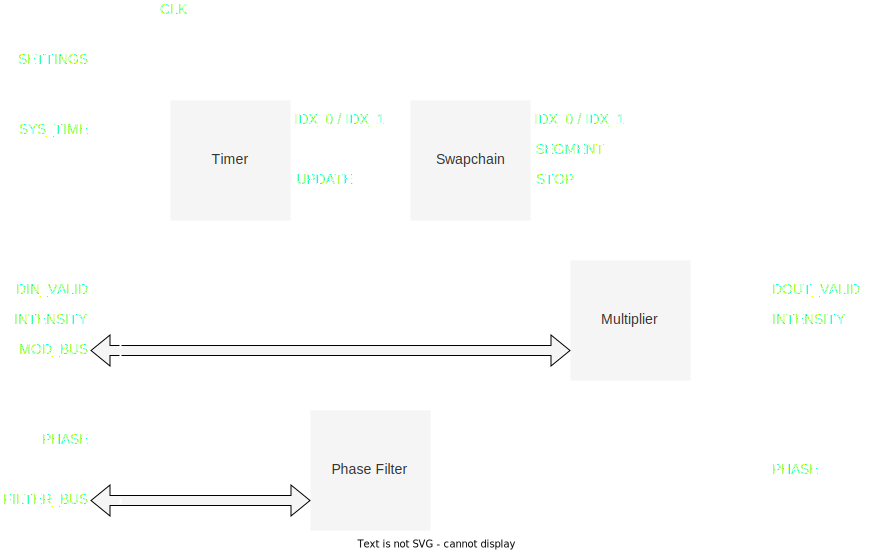

# Modulation

<figure>
  
  <figcaption>Modulationモジュール</figcaption>
</figure>

| Name                          | In/Out | Width | Description                                        | 
| ----------------------------- | ------ | ----- | -------------------------------------------------- | 
| CLK                           | In     | 1     | 20.48MHzクロック                                   | 
| SETTINGS                      | In     | -     |                                                    | 
| ├─ REQ_RD_SEGMENT             | In     | 1     | 要求読み込みセグメント                             | 
| ├─ CYCLE_0                    | In     | 15    | 第0セグメントの周期$-1$                            | 
| ├─ FREQ_DIV_0                 | In     | 32    | 第0セグメントの周波数分周比                        | 
| ├─ REP_0                      | In     | 32    | 第0セグメントの繰り返し回数$-1$                    | 
| ├─ CYCLE_1                    | In     | 15    | 第1セグメントの周期$-1$                            | 
| ├─ FREQ_DIV_1                 | In     | 32    | 第1セグメントの周波数分周比                        | 
| └─ REP_1                      | In     | 32    | 第1セグメントの繰り返し回数$-1$                    | 
| SYS_TIME                      | In     | 64    | システム時刻                                       | 
| DIN_VALID                     | In     | 1     | 強度/位相データ有効フラグ                          | 
| INTENSITY_IN                  | In     | 8     | 強度                                               | 
| PHASE_IN                      | In     | 8     | 位相                                               | 
| INTENSITY_OUT                 | Out    | 16    | 強度                                               | 
| PHASE_OUT                     | Out    | 8     | 位相                                               | 
| DOUT_VALID                    | Out    | 1     | 強度/位相データ有効フラグ                          | 
| MOD_BUS                       | In     | -     | 変調用メモリバス                                   | 
| FILTER_BUS                    | In     | -     | 位相フィルタ用メモリバス                           | 

このモジュールは, 強度データに変調データを掛け合わせることでAM変調を実現するモジュールである.
変調データは一定の周期でメモリからサンプルされる.
変調データ領域は2つのセグメントに分けられており, それぞれ独立に設定できる.

また, 位相に関してはオフセットを加える処理を行う.
> NOTE: この処理は変調ではないが, 強度データと歩調を合わせるためにここで処理している.

## Timer

このサブモジュールは, システム時刻, 周期$T$, 周波数分周比$N$から, 現在読み込むべき変調データのインデックスを計算する.
変調データのインデックス$i$は
$$\begin{align}
    i = \left\lfloor \frac{\text{SYS\_TIME}}{N} \right\rfloor \,\%\, T
\end{align}$$
として計算される.
`SYS_TIME`は$\SI{20.48}{MHz}$でカウントアップされため, AMデータのサンプリング周波数$f$は
$$\begin{align}
    f = \frac{\SI{20.48}{MHz}}{N}
\end{align}$$
となり, $i$はこの周波数で$0$から$T−1$まで周期的にカウントアップされる.

`SYS_TIME`がすべてのデバイスで同期しているため, このインデックスも必然的にすべてのデバイスで同期する.

> NOTE: `SETTINGS`で指定する`CYCLE`は$T−1$であることに注意する.

## Swapchain

このサブモジュールはセグメントの切り替えを制御する.

セグメント切替時の挙動は以下の通りである.

1. 現在のセグメントが0, 要求されたセグメントが0の場合, 何もしない.
1. 現在のセグメントが0, 要求されたセグメントが1の場合
    1. 第1セグメントの繰り返し回数が0xFFFFFFFFの場合, 直ちにセグメントを1に切り替え, 無限ループする.
    1. 第1セグメントの繰り返し回数が0xFFFFFFFF以外の場合, 第1セグメントのインデックスが0になるまで待機する. 第1セグメントのインデックスが0になったら, セグメントを1に切り替える. 指定回数の繰り返しが終わった後, `STOP`をアサートする.
1. 現在のセグメントが1の場合も同様

> NOTE: `SETTINGS`で指定する`REP`は繰り返し回数$−1$であることに注意する.

## Multiplier

このサブモジュールは, 強度データに変調データを掛け合わせる.

変調データは`Swapchain`モジュールから渡される, `SEGMENT`, `IDX`に応じてメモリから読み出す.
なお, `STOP`フラグがアサートされている間は, セグメント及びインデックスを更新しない.

## Phase filter

このサブモジュールは, 位相データにオフセットを加える.
オフセットはメモリから読み出す.
