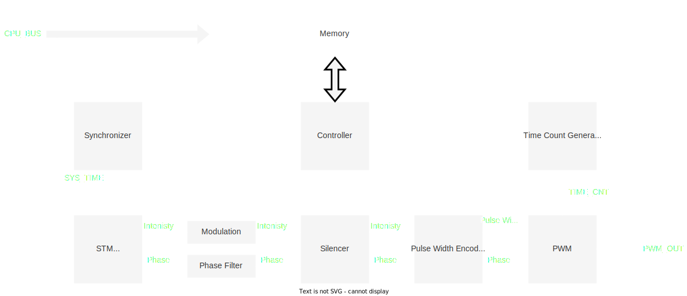

# 概要

FPGAにおける信号生成の流れを以下に示す.
なお, あくまで概念図なので実際の実装とは都合により異なる.

<figure>
  
  <figcaption>FPGA内部の概要図</figcaption>
</figure>

まず, CPUから送られてきたデータはすべて`Memory`モジュール内のBlock RAM (BRAM) に格納される.
`STM`モジュールは一定のサンプリングレート ($=\ufreq$) で振幅/位相データをサンプリングし, そのデータを続く`Modulation`モジュールにわたす.
振幅データは`Modulation`モジュール内で変調データと掛け合わされる.
振幅/位相データはその後, `Silencer`モジュールにより静音化処理 (急峻な変化を抑える処理) が施される.
振幅データは`Pulse Width Encoder`モジュールにより, パルス幅データに変換される.
そして, 最後にパルス幅/位相データからPulse Width Modulation (PWM) 波形の出力を計算する.

以下に, 各モジュールの解説をしていく.
なお, 説明の都合上, 信号の流れる順とは異なる順序で説明する.
