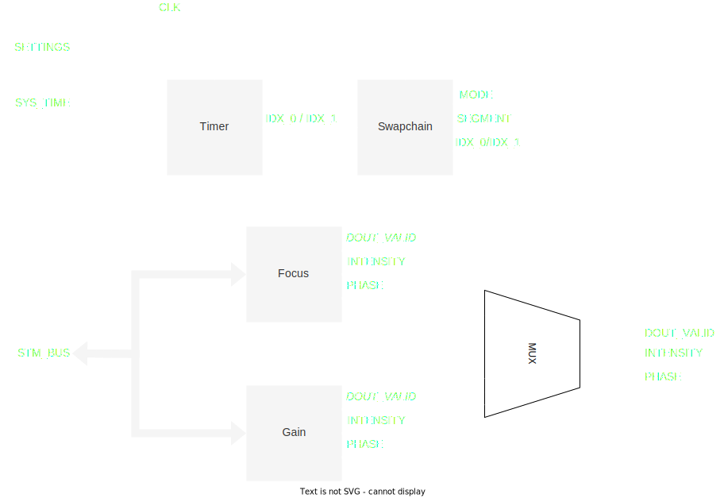

# STM

<figure>
  
  <figcaption>STMモジュール</figcaption>
</figure>

| Name                          | In/Out | Width | Description                                        | 
| ----------------------------- | ------ | ----- | -------------------------------------------------- | 
| CLK                           | In     | 1     | 20.48MHzクロック                                   | 
| SETTINGS                      | In     | -     |                                                    | 
| ├─ REQ_RD_SEGMENT             | In     | 1     | 要求読み込みセグメント                             | 
| ├─ CYCLE_0                    | In     | 15    | 第0セグメントの周期$-1$                            | 
| ├─ FREQ_DIV_0                 | In     | 32    | 第0セグメントの周波数分周比                        | 
| ├─ REP_0                      | In     | 32    | 第0セグメントの繰り返し回数$-1$                    | 
| ├─ SOUND_SPEED_0              | In     | 32    | 第0セグメントの音速                                | 
| ├─ CYCLE_1                    | In     | 15    | 第1セグメントの周期$-1$                            | 
| ├─ FREQ_DIV_1                 | In     | 32    | 第1セグメントの周波数分周比                        | 
| ├─ REP_1                      | In     | 32    | 第1セグメントの繰り返し回数$-1$                    | 
| └─ SOUND_SPEED_1              | In     | 32    | 第1セグメントの音速                                | 
| SYS_TIME                      | In     | 64    | システム時刻                                       | 
| INTENSITY                     | Out    | 7     | 強度                                               | 
| PHASE                         | Out    | 7     | 位相                                               | 
| DOUT_VALID                    | Out    | 1     | 強度/位相データ有効フラグ                          | 
| STM_BUS                       | In     | -     | 位相フィルタ用メモリバス                           | 

本モジュールは, 強度/位相データを出力する.

## Timer

このサブモジュールは, システム時刻, 周期$T$, 周波数分周比$N$から, 現在読み込むべきデータのインデックスを計算する.
変調データのインデックス$i$は
$$\begin{align}
    i = \left\lfloor \frac{\text{SYS\_TIME}}{N} \right\rfloor \,\%\, T
\end{align}$$
として計算される.
`SYS_TIME`は$\SI{20.48}{MHz}$でカウントアップされため, データのサンプリング周波数$f$は
$$\begin{align}
    f = \frac{\SI{20.48}{MHz}}{N}
\end{align}$$
となり, $i$はこの周波数で$0$から$T−1$まで周期的にカウントアップされる.

`SYS_TIME`がすべてのデバイスで同期しているため, このインデックスも必然的にすべてのデバイスで同期する.

> NOTE: `SETTINGS`で指定する`CYCLE`は$T−1$であることに注意する.

## Swapchain

このサブモジュールはセグメントの切り替えを制御する.

セグメント切替時の挙動は以下の通りである.

1. 現在のセグメントが0, 要求されたセグメントが0の場合, 何もしない.
1. 現在のセグメントが0, 要求されたセグメントが1の場合
    1. 第1セグメントの繰り返し回数が0xFFFFFFFFの場合, 直ちにセグメントを1に切り替え, 無限ループする.
    1. 第1セグメントの繰り返し回数が0xFFFFFFFF以外の場合, 第1セグメントのインデックスが0になるまで待機する. 第1セグメントのインデックスが0になったら, セグメントを1に切り替える. 指定回数の繰り返しが終わった後, `STOP`をアサートする.
1. 現在のセグメントが1の場合も同様

> NOTE: `SETTINGS`で指定する`REP`は繰り返し回数$−1$であることに注意する.

## Gain

このモジュールは, 指定されたインデックスのデータを順次出力するだけである.

## Focus

このモジュールはBRAMに書き込まれた焦点の位置データから適切な位相を計算して出力する.

焦点の位置データはデバイスにローカルな座標系で表現される.
また, 位置データは$\SI{18}{bit}$符号あり固定小数点数で表現される.
この単位は$\SI{0.025}{mm}$である.

このモジュールでは, 焦点位置データ$\br_\text{f}$と, 振動子の位置データ$\br_\text{tr}$, 及び, 音速 (`SOUND_SPEED`, $c$) から, 振動子の位相を計算する.
ここで, 音速の単位は$\SI{1/1024}{m/s}$である.
また, 振動子のローカル座標における位置データはあらかじめ計算しておくことができるため, これを専用のBRAMに格納しておく.

> NOTE: 振動子の位置データは`tr.coe`に格納されている.

まず, $\br_\text{f}$と$\br_\text{tr}$の間の距離を計算する.
$$\begin{align}
    d = \sqrt{\|\br_\text{f} - \br_\text{tr}\|^2} \times \SI{0.025}{mm}
\end{align}$$
また,
音速$c$から波長$\lambda$を計算すると,
$$\begin{align}
    \lambda = \frac{c}{f} = \frac{c \times \frac{1}{1024}\SI{}{m/s}}{\SI{40}{kHz}} = \frac{c}{2^{10}}  \times \SI{0.025}{mm}
\end{align}$$
となる.
よって, 位相$P$は
$$\begin{align}
    P & = \left(256\times\frac{d}{\lambda}\right) \,\%\,256                                \\
      & = \frac{\sqrt{\|\br_\text{f} - \br_\text{tr}\|^2} \times 2^{18}}{c} \,\%\,256
\end{align}$$
と計算できる.

> NOTE: $256$が$2\pi$に対応することに注意.
