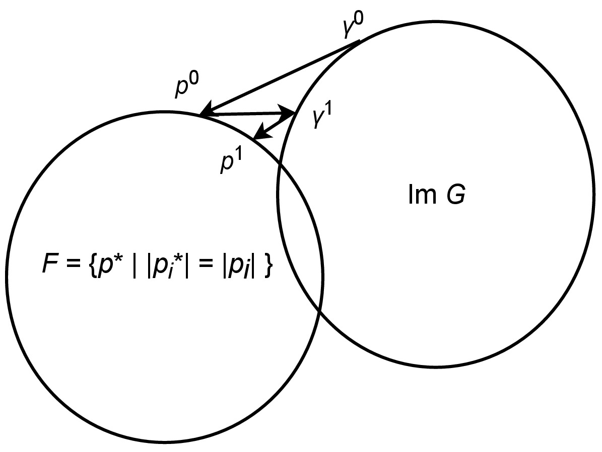

# 逆伝搬法

Author: Shun Suzuki

Date: 2024-01-09

- - -

この章では, 焦点からの逆伝搬を用いる解法を記す.

## ナイーブな方法

ナイーブな方法では, 制御点の位相をすべて$0$として, 単純に焦点から逆伝搬した解を重ね合わせる.
すなわち,
$$\begin{aligned}
    a_j\rme^{-\im\phi_j} = \sum_i \overline{G_{ij}}|p(\br_i)|
\end{aligned}$$
である.
(実際には, ここからさらに振動子の出力の制約を満たすようにする必要がある.)

しかし, すでに何度も述べたように, 焦点の位相に対しては最適化の余地がある.

## Gerchberg-Saxton (GS) 法

まず, Marzoらの提案したフェーズドアレイ用の焦点位相回復について述べる[^marzo2019holographic].
以下が, そのアルゴリズムである.

1. 初期化: $\bq^{(0)} = \bone$
1. 以下を$n$回繰り返す:
    1. 順伝搬: $\bgamma^{(n)} = G \bq^{(n-1)}$
    1. 焦点の正規化:
        $p^{(n)}(\br_i) =\frac{\gamma_i^{(n)}}{\left|\gamma_i^{(n)}\right|}|p(\br_i)|$
    1. 逆伝搬: $\bxi^{(n)} = G\hermite\bp^{(n)}$
    1. 振動子の正規化:
        $q_j^{(n)} =\frac{\xi_j^{(n)}}{\left|\xi_j^{(n)}\right|}a_j$

このアルゴリズムは$G$の像$\mathrm{Im}\,G$, すなわち, フェーズドアレイが実際に出力できる音場の集合と, 目標音場の集合$F=\left\lbrace \bp^* \mid |p_i^*| = |p_i| \right\rbrace$との間を交互に射影しながら, その積集合$\mathrm{Im}\,G\cap{F}$内の一点を求めている.
このように, 伝搬逆伝搬を繰り返して, 望みの場に収束させる方法を, Gerchberg-Saxton (GS) 法[^gerchberg1972practical]やIterative Fourier transform algorithm (IFTA) [^wyrowski1988iterative] [^wyrowski1989iterative] と呼ぶ.

以下にGS法の概念図を示す.
GS法は2つの集合が凸包である場合には収束する[^cheney1959proximity].
このとき, $\mathrm{Im}\,G\cap{F} \ne \emptyset$なら, $p \in \mathrm{Im}\,G\cap{F}$に, そうでないのなら, $\mathrm{Im}\,G, F$間の距離を最小にする点に収束する[^8].
しかし, 今回は集合$F$は凸ではない.
そのため, 収束は保証されないが, 実用的にはほとんど問題ない解が出てくることが確かめられている.

<figure>
        <figcaption>GS法の概念図</figcaption>
</figure>

なお, このアルゴリズムでは振動子の振幅成分を決定できない.
論文 [^marzo2019holographic]では, 振動子の振幅は固定されている($a_j=1, \forall j$).

### GS for Phased Arrays of Transducers (GS-PAT)

上記をさらに最適化したアルゴリズムとして, GS-PATが提案されている [^plasencia2020gs].

この論文の主目的は高速化である.
GS法の繰り返し第4ステップがなくなれば, 1,3,4ステップををまとめて$\bgamma^{(n)} = GG\hermite\bp^{(n-1)}$とかける, ということから着想を得ている.
そこで, 以下の規格化逆伝搬行列$B$を考える.

$$\begin{align}
    B = \left(\begin{array}{cc}
            \frac{\overline{G_{00}}}{\sum_{j} |G_{0j}|^2}    & \cdots & \frac{\overline{G_{M-1,0}}}{\sum_{j} |G_{M-1,j}|^2}   \\
            \vdots                                           & \ddots & \vdots                                                \\
            \frac{\overline{G_{0,N-1}}}{\sum_{j} |G_{0j}|^2} & \cdots & \frac{\overline{G_{M-1,N-1}}}{\sum_{j} |G_{M-1,j}|^2}
        \end{array}\right)
\end{align}$$
この$B$の意味は[固有値問題と行列方程式](./evp.md)の行列$X$とほとんど同じである.
この$B$を用いて, GS-PATのアルゴリズムは次のように表される.

1. 初期化: $\bp^{(0)} = (|p_0|, ..., |p_{M-1}|)\trans$
1. 以下を$n$回繰り返す:
    1. $\bgamma^{(n)} = GB\bp^{(n-1)}$
    1. $\bp^{(n)} = [p^{(n)}(\br_0), ..., p^{(n)}(\br_{M-1})], p_i^{(n)} =\frac{\gamma_i^{(n)}}{\left|\gamma_i^{(n)}\right|}\left|p_i^{(0)}\right|$

第4ステップを避けて, $B$を使うことのメリットは2つある.

1. $GB$はあらかじめ計算でき, その次元は$M\times M$である.
   ほとんどの場合, $M < N$であるため, 各ステップの行列計算量は少なくなり, 計算速度の面で有利.
1. 振動子の振幅の自由度を残したままにできる.

[^marzo2019holographic]: Marzo, Asier, and Bruce W. Drinkwater. "Holographic acoustic tweezers." Proceedings of the National Academy of Sciences 116.1 (2019): 84-89.

[^gerchberg1972practical]: Gerhberg, R., and W. Saxton. "A practical algorithm for the determination of phase from image and diffraction plane picture." Optik 35 (1972): 237-246.

[^wyrowski1988iterative]: Wyrowski, Frank, and Olof Bryngdahl. "Iterative Fourier-transform algorithm applied to computer holography." JOSA A 5.7 (1988): 1058-1065.

[^wyrowski1989iterative]: Wyrowski, Frank. "Iterative quantization of digital amplitude holograms." Applied optics 28.18 (1989): 3864-3870.

[^cheney1959proximity]: Cheney, Ward, and Allen A. Goldstein. "Proximity maps for convex sets." Proceedings of the American Mathematical Society 10.3 (1959): 448-450.

[^8]: ただし, 有限回のステップで収束することは保証されていない.

[^plasencia2020gs]: Plasencia, Diego Martinez, et al. "GS-PAT: high-speed multi-point sound-fields for phased arrays of transducers." ACM Transactions on Graphics (TOG) 39.4 (2020): 138-1.
