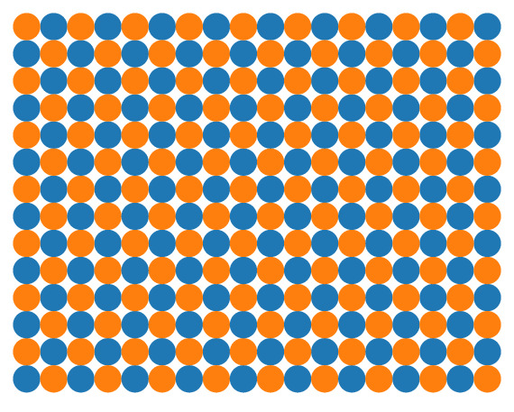

# 空間分割スキーム

Author: Shun Suzuki

Date: 2024-01-09

- - -

この問題に対する解の1つは, フェーズドアレイを$M$個に空間的に分割して, それぞれのアレイが単一焦点を出すことである.
分割のパターンにはいくつかのバリエーションが考えられる.
以下に二分割の場合の例を載せる.

<table>
    <tr style="background: none">
        <td><figure>
        <figcaption>(a) 左右</figcaption>
        </figure></td>
        <td><figure>
        <figcaption>(b) 縦縞</figcaption>
        </figure></td>
    </tr>
    <tr style="background: none">
        <td><figure>
        <figcaption>(c) 横縞</figcaption>
        </figure></td>
        <td><figure>
        <figcaption>(d) 市松模様</figcaption>
        </figure></td>
    </tr>
</table>

どのような分割が最適かは, アレイの配置や焦点の位置に依存する.
(私の知る限りでは) ヒューリスティックに決める以外の方法はない.
そのため, SDKには実装されていない.

> NOTE: `Controller::group`や`Gain::group`を用いることで, アレイを分割すること自体は可能.

この手法は焦点の数が増えてきたらどうすべきか, といった問題や, 各焦点どうしの干渉などを一切考慮していない, などの問題がある.

逆に, これらが無視できるような状況, 例えば, アレイが十分に大きく焦点どうしも十分に離れている場合などでは優れた手法となる.

フェーズドアレイ分割法の計算量は, (分割に係る計算量を無視すれば) $O(N)$である.
