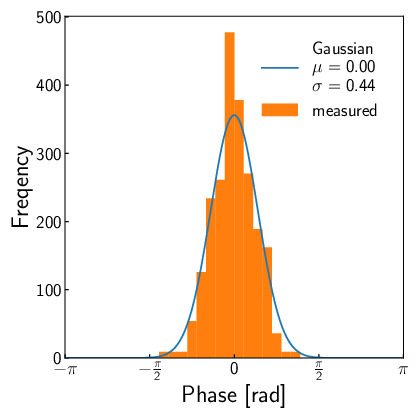

# フェーズドアレイの線形性

Author: Shun Suzuki

Date: 2024-01-06

- - -

ここでは, フェーズドアレイの線形性について考察する.
超音波振動子にはそれぞれ個体差がある.
同じ駆動信号を振動子に印加しても, 個体によって放射される超音波の位相や振幅は異なる.
以下では, この個体差が焦点生成にどのような影響を与えるか考えてみよう.

$n$個の振動子を考え, 全ての振動子に同じ駆動信号を与えたとき振動子が放射する超音波の音圧を$a_i, i=1,2,...,n$とおく.
ここで, $a_i$が正規分布に独立かつ同一に従うと仮定する.
$$\begin{aligned}
  a_i \overset{\text\small\textrm{iid}}{\sim} \mathcal{N}(a, \sigma_a^2).
\end{aligned}$$
また, 放射する超音波の位相$\phi_i$についても同様のことを仮定する.
$$\begin{aligned}
  \phi_i \overset{\text\small\textrm{iid}}{\sim} \mathcal{N}(0, \sigma_\phi^2).
\end{aligned}$$

焦点がフェーズドアレイから十分に遠く, かつ, 指向性や減衰係数が全ての振動子で同一であると仮定すると, 焦点における音圧$p$は
$$\begin{aligned}
  p \propto \left|\sum_i a_i\rme^{\im \phi_i}\right|
\end{aligned}$$
となる.
ここで, 位相の分散が十分に小さいと仮定すると,
$$\begin{aligned}
  E[p] & \propto E[a_i]  \left|\sum_i \rme^{\im \phi_i}\right|          \\
       & \sim a \left|\sum_i \left(1 - \frac{\phi_i^2}{2}\right)\right|
\end{aligned}$$
となる.
ここで, $\sum_i \phi_i^2/\sigma_\phi^2$は自由度$n$の$\chi^2$分布に従うので,
$$\begin{aligned}
  E[p] & \propto a \left|n - n\frac{\sigma_\phi^2}{2}\right| \\
       & = na \left|1 - \frac{\sigma_\phi^2}{2}\right|
\end{aligned}$$
となる.

すなわち, **焦点の音圧の期待値は振動子の数$n$に対して線形増加する**.
また, 振動子1個あたりの期待音圧は$a\left|1 - \sigma_\phi^2/2\right|$となる.

以下に振動子の振幅と位相の個体差を測定したものを載せる.
測定は振動子の直上$\SI{200}{mm}$で行い, マイクの飽和を避けるためデューティー比は$10/255\times \SI{50}{\%}$とした.
この測定を$2241$個の振動子に対して行った.
正規分布でフィッティングした結果, 位相の標準偏差は$\sigma_\phi = \SI{0.44}{rad}$であった.
したがって, **振動子の期待音圧は個体差がないと仮定した場合の約$0.9$倍になる**と考えられる.

<figure>

<figcaption>観測された振幅の個体差. サンプル数は2241.</figcaption>
</figure>

<figure>

<figcaption>観測された位相の個体差. サンプル数は2241.</figcaption>
</figure>
