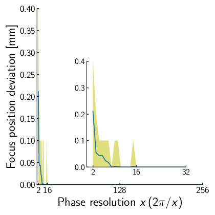

# 位相, 及び, 振幅の必要分解能

Author: Shun Suzuki

Date: 2024-01-06

- - -

ここでは, 焦点を生成するのに必要な位相, 及び, 振幅の必要分解能について考察する. 
AUTD3はどちらも$\SI{8}{bit}$の分解能を持つ.
これは実装の都合で決定されたものであり, 理論的な背景があるものではない.
以下では, これらについて考えてみよう.

まず, 位相の分解能について考えてみる. $54\times 42$個の振動子を並べ, アレイの中心から直上500 mmの位置に焦点を生成することを考える.

以下に位相の分解能$x$, すなわち, 振動子の取りうる位相を$2\pi i/x, i=0,1,...,x-1$とした場合の, 焦点の音圧をシミュレートしたものを示す.
なお, 焦点音圧は単純な球面波の重ね合わせから計算した.

<figure>

  

<figcaption>位相の分解能に対する焦点の音圧. 右下のグラフは$x=2$から$x=32$の拡大図.</figcaption>
</figure>

また, 以下に位相の分解能に対する焦点位置の精度, すなわち, 期待する焦点位置と実際に音圧の最大値を取る点との誤差を示す.
ここで, 焦点の位置$\bp$はアレイ中心を原点とし, $\bp=(0.1n, 0, 500)\,\mathrm{mm}, n=1,2,...,85$とした.

<figure>

  

<figcaption>位相の分解能に対する焦点の位置の誤差.
青線は平均, 色つきの範囲は値が存在する範囲を示す. 右下のグラフは$x=2$から$x=32$の拡大図.</figcaption>
</figure>

以上の図に示すように, 16段階, すなわち$\SI{4}{bit}$の分解能があれば, 音圧はほぼ上限に達し, 焦点位置の誤差も$\SI{0.1}{mm}$以下であることがわかる.
したがって, **少なくとも単一焦点生成には位相は$\SI{4}{bit}$で十分**である.

一方, 振幅についてどの程度の分解能が必要なのか明確な根拠は現在存在しない.
そのため, 現在は経験的に振幅を$\SI{8}{bit}$にしている.
また, 実装が楽なので位相も$\SI{8}{bit}$にしている.

なお, 静音化など処理を考えると, 振幅も内部的には十分な分解能を持つことが望ましい.
通信時は$\SI{4}{bit}$で行い, FPGAやマイコンでより細かく分割するなどの方がいいかもしれない.
振幅の必要分解能については将来の研究に任せることにする.
