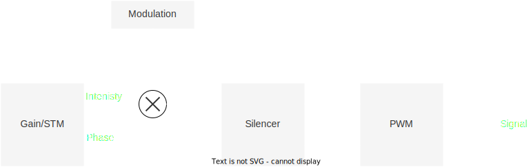

# コンセプト

SDKを構成する主なコンポーネントは以下の通りである.

* `Controller` - コントローラクラス. AUTD3に対する全ての操作はこのクラスを介して行う.
* `Geometry` - デバイスの位置関係を管理するクラス. `Device`のコンテナ.
  * `Device` - AUTD3デバイスに対応するクラス. デバイスが現実世界でどのように配置されているかを管理する. `Transducer`のコンテナ.
  * `Transducer` - 振動子に対応するクラス. 振動子が現実世界でどこにあるかを管理する.
* `Link` - クライアントソフトウェアとデバイスとのインターフェース.
* `Gain` - 各振動子の位相/振幅を管理するクラス.
* `STM` - Spatio-Temporal Modulation (STM, 時空間変調) 機能を提供するクラス. 各振動子の位相/振幅データの時間列を管理する.
* `Modulation` - AM変調機能を提供するするクラス. 変調データの時間列を管理する.
* `Silencer` - 静音化処理を管理するクラス.

ソフトウェアの使用方法は以下の通りである.

まず, 現実世界のAUTD3デバイスの配置を指定し, どの`Link`を使用するかを決め, `Controller`を開く.
次に, `Controller`クラスを介して, `Gain` (または`STM`), `Modulation`, `Silencer`データをデバイスに送信する.

送信されたデータに基づいたPWM信号が振動子に印加される.
信号が生成されるまでの流れは以下の図の通りである.

<figure>
  
  <figcaption>信号が生成されるまでの概念図</figcaption>
</figure>

`Gain`/`STM`で指定された振幅データは, `Modulation`で指定された変調データと順次掛け合わされた後, `Silencer`に渡される.
`Gain`/`STM`で指定された位相データは, そのまま`Silencer`に渡される.
`Silencer`は, これらのデータを静音化処理[^silencer]する.
最後に, `Silencer`で処理された振幅/位相データに基づきPWM信号が生成され, 振動子に印加される. 

なお, 振幅/位相データ, 及び, 変調データはすべて$\SI{8}{bit}$である.

## AUTD3デバイス

以下にAUTD3の前面と背面写真を載せる.

<figure>
  
  <figcaption>AUTDの表面写真</figcaption>
</figure>

<figure>
  
  <figcaption>AUTD背面写真</figcaption>
</figure>

AUTD3は一台あたり249個の振動子から構成されている[^fn_asm].
SDKからはこの全ての振動子の位相/振幅をそれぞれ個別に指定できるようになっている.
AUTD3の座標系は右手座標系を採用しており, 0番目の振動子の中心が原点になる.
x軸は長軸方向, すなわち, 0→17の方向であり, y軸は0→18の方向である.
また, 単位系として, 距離はmmを採用している.
振動子は$\SI{10.16}{mm}$の間隔で配置されており, 基板を含めたサイズは$\SI{192}{mm}\times\SI{151.4}{mm}$となっている.

以下に振動子アレイの寸法を載せる.

<figure>
  
  <figcaption>AUTD3デバイスの寸法</figcaption>
</figure>

さらに, AUTD3は復数のデバイスをデイジーチェインで接続し拡張できるようになっている.
PCと1台目のEherCAT In をイーサネットケーブルを繋ぎ, $i$台目のEherCAT Outと$i+1$台目のEherCAT Inを繋ぐことで拡張アレイを構成できる.
この時, イーサネットケーブルはCAT 5e以上のものを使用すること.

AUTD3の電源は$\SI{24}{V}$の直流電源を使用する. 電源についても相互に接続でき, 電源コネクタは3つの内で好きなところを使って良い.
なお, 電源のコネクタはMolex社5566-02Aを使用している.

> NOTE: AUTD3は最大でデバイスあたり$\SI{2}{A}$の電流を消費する. 電源の最大出力電流に注意されたい.

[^silencer]: 詳細は[Silencer](./silencer.md)を参照.

[^fn_asm]: $18\times 14=252$からネジ用に3つの振動子が抜けている. 態々この位置にネジ穴を持ってきたのは, 複数台並べたときの隙間を可能な限り小さくしようとしたため.
